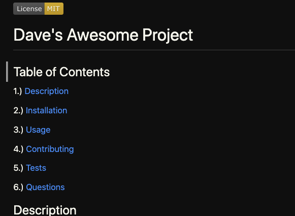
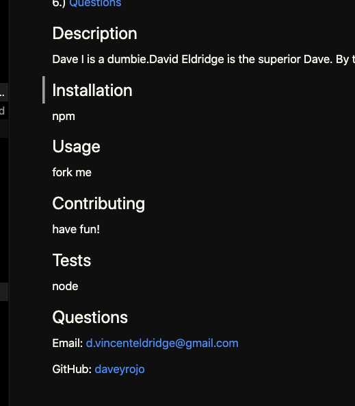

# ReadMe Generator

## Goal:
    Use inquirer to generate a read me file that has:
        - table of contents with clickable links
        - set sub sections
        - a visible license
        - a link to the user's GitHub

## Goal Met:
    I met the above goals.
    I was able to achieve this with a different approach than what was proposed via skeleton code by using objects with the licenses for the answers.
    This meant I didn't have to use 2-3 functions simply to generate the license visual.

## Screen Shots
Top:

Bottom:

## Link to Deployment Video
[Screencastify Video](https://drive.google.com/file/d/1J7mdkCOYzK3FkVK0O247DrPSAFy7qGBr/view)